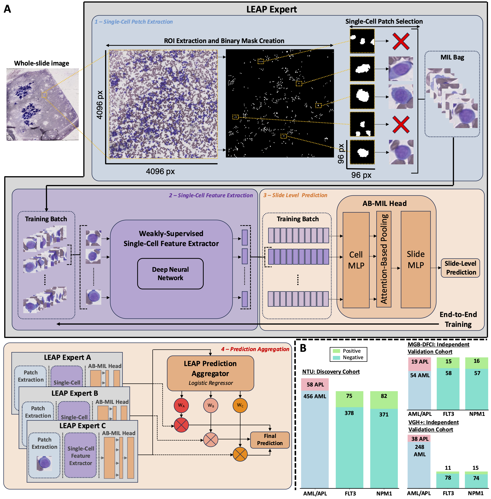

# LEAP - Leukemia End-to-End Analysis Platform
<a href="https://pytorch.org/get-started/locally/"></a>

### A Generalizable AI Framework for Predicting Clinically Actionable Subtypes, Molecular Alterations, and Prognosis in Patients with Acute Myeloid Leukemia – A Multi-Center Validation Study 

Guillaume Larghero^, Chia-Jen Liu^, Junhan Zhao^, Xavier Cheng-Hong Tsai^, Yao-Chung Liu, Christian Engel, Ting-Wan Kao, Vignesh Shanmugan, William Yuan, Hung-Ruei Chen, Ying-Chung Hong, Chun-Kuang Tsai, Chieh-Lin Teng, Yuan-Bin Yu, Hsin-An Hou, Hwei-Fang Tien, Wen-Chien Chou, Joan How, Jean M. Connors, Maximilian Stahl, Kun-Hsing Yu<sup>*</sup>. 

*Lead Contact: Kun-Hsing Yu, M.D., Ph.D.*

#### ABSTRACT 
*Acute myeloid leukemia (AML) is one of the most prevalent and aggressive hematologic malignancies, requiring accurate and timely diagnosis for effective treatment. Bone marrow pathology evaluation by hematopathologists remains the gold standard but is inherently labor-intensive, and reliant on expert interpretation, which can delay critical treatment decisions–especially for subtypes like acute promyelocytic leukemia (APL) that require immediate intervention. To address this critical clinical challenge, we established the Leukemia End-to-End Analysis Platform (LEAP), a generalizable deep learning framework for AML subtyping, genetic mutation detection, and survival prediction from whole-slide bone marrow pathology smears. We benchmarked LEAP against state-of-the-art pathology foundation models using a diverse real-world dataset of 873 newly diagnosed AML patients from six medical centers. LEAP achieved near-perfect performance in distinguishing APL from other AML subtypes (AUROC = 0.981 ± 0.01), potentially enabling the rapid initiation of all-trans retinoic acid treatment in the emergency room. In addition, LEAP outperformed existing foundation models in predicting key prognostic mutations in AML, including FLT3 (Balanced Accuracy = 0.94 ± 0.09) and NPM1 (0.83 ± 0.03). LEAP further predicted patient survival and effectively stratifies patients into distinct risk groups (log-rank test p value < 0.001) across all cohorts. Overall, LEAP enhanced bone marrow pathology evaluation performance by 49% (95% confidence interval: 24.8–75.1%) compared to standard pathology foundation models. Our findings challenge the prevailing assumption about the generalizability of foundation AI models and highlight the need to tailor AI frameworks in specific clinical applications. By automating and accelerating critical pathology evaluation workflows, LEAP has the potential to identify patients requiring immediate treatments, democratize diagnostic expertise, and streamline clinical decision-making, which will advance the development of personalized medicine.*




### Prerequisites

This project uses [Conda](https://docs.conda.io/en/latest/) to manage its environment and dependencies. Before installing, please ensure you have either [Miniconda](https://docs.conda.io/en/latest/miniconda.html) or [Anaconda](https://www.anaconda.com/products/distribution) installed on your system.

The required dependencies for this project are defined in the `environment_LEAP.yml` and `environment_preprocessing.yml` files. This first file specifies Python 3.11.9 along with all the necessary packages (both Conda and pip packages) while you will need python 3.8.19 for the preprocessing (single-cell patch extraction).

#### Setting Up the Environment

1. **Clone the Repository**

   Make sure you have cloned the repository to your local machine.

2. **Create the Environment**

   Open a terminal in the repository’s root folder (where the `environment_LEAP.yml` file is located) and run:

   ```bash
   conda env create -f environment_LEAP.yml
   ```
   or
   ```bash
   conda env create -f environment_preprocessing.yml
   ```

   This command will create a new Conda environment named LEAP (or preprocessing ; as specified in the YAML file) with all the dependencies installed.

3. **Activate the Environment**

   Once the environment is created, activate it using:
   ```bash
   conda activate LEAP
   ```
   or
   ```bash
   conda activate preprocessing
   ```

## Single-Cell Patch Extraction

The LEAP platform works with a multiple instance learning (MIL) framework and requires extracted patches to constitute the MIL bag.

To run the single-cell extraction script:

1. **Configure Settings:**  
   Open the configuration file `single_cell_extraction.yaml` and update the following:
   - **input_dir:** The folder where your Whole Slide Images (WSI) are stored.
   - **output_dir:** The folder where your extracted single-cell patches will be stored as a `.ZIP` file.

2. **Run the Extraction Script:**  
   Navigate to the `preprocessing/` directory and execute:
   ```bash
   python single_cell_extraction.py --config-name single_cell_extraction


## LEAP-Expert Training

To train a LEAP expert, follow these steps:

1. **Configure Settings:**  
   - Open the configuration file `train_LEAP_expert.yaml` and update the parameters based on the expert you want to train.
   - The main customizable components include:
     - **Feature Extractor Architecture:** Options such as `DenseNet121`, `ResNet50`, or `VGG19`.
     - **Classification Head:** Currently, only `AB-MIL` is supported.
     - **Training Script Parameters:** Configure settings for loss, optimizer, validation formula, and performance threshold to combat overfitting.
   - Specify the paths to your data, including the cell patches you extracted previously and your label files.

2. **Data Requirements:**  
   To train a LEAP expert, you need an Excel file (`.xlsx`) that contains at least two columns:
   - **Slide_ID:** Contains the slide names (which should match the cell ZIP folder names).
   - **Label:** Contains the corresponding labels.

After updating the configuration and ensuring your data is properly prepared, you can run the training script:
Navigate to the `scripts/` directory and execute:
   ```bash
   python train_LEAP_expert.py --config-name train_LEAP_expert
   ```
The scripy automatically saves your model (as .pth files, one for each fold), your model training and validation performances (as tensorboard logs to visualize the training), your model metrics on the held-out test sets, and your model logits for further analysis.


## LEAP Expert - Aggregation

Once you have trained multiple LEAP experts (for instance, three experts with different feature extractor architectures), you can aggregate their outputs to enhance performance.

1. **Configure Aggregation Settings:**  
   - Open the configuration file `aggregate_LEAP_experts.yaml`.
   - Update the file by adding your trained models and specifying any necessary aggregation parameters.

2. **Run the Aggregation Script:**  
   - Navigate to the `scripts/` folder.
   - Execute the following command:
     ```bash
     python aggregate_LEAP_experts.py --config-name aggregate_LEAP_experts
     ```

This will aggregate the predictions from your multiple LEAP experts.

