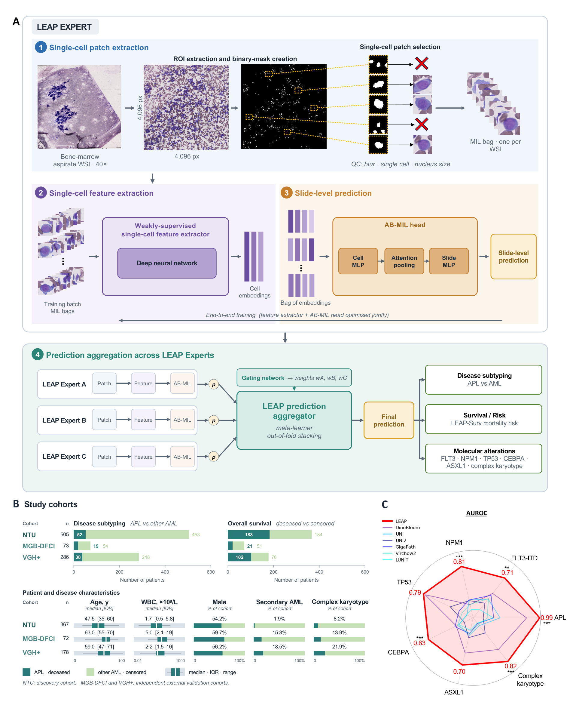

# LEAP — Leukemia End-to-End Analysis Platform

[](https://pytorch.org/)
[](LICENSE)

### Single-cell AI for Acute Promyelocytic Leukemia Recognition: Multicenter Validation and a Randomized Clinician-AI Collaboration Study

Larghero G^, Liu CJ^, Zhao J^, Tsai XCH^, Liu YC, Engel C, Kao TW, Vremenko D, Ji-Xu A, Shanmugan V, Yuan W, Chen HR, Hong YC, Tsai CK, Teng CL, Yu YB, Jackson C, Zhang Y, Lin YH, Zhu M, Xiao Q, Schiefer AI, Munjal K, Chen D, Hou HA, Tien HF, Chou WC, How J, Connors JM, Stahl M, Yu KH+.

*^These authors contributed equally to this manuscript. +Correspondence to Kun-Hsing Yu.*

*Lead Contact: Kun-Hsing Yu, M.D., Ph.D.*

#### ABSTRACT

Acute myeloid leukemia (AML) is one of the most prevalent and aggressive hematologic malignancies, requiring accurate and timely diagnosis to guide effective treatment. This is especially critical for subtypes such as acute promyelocytic leukemia (APL), which require immediate intervention with all-trans retinoic acid. To address this clinical need, we developed and validated LEAP, an artificial intelligence (AI) framework processing whole-slide images (WSIs) of routine bone marrow smears from newly diagnosed AML patients. We benchmarked LEAP against state-of-the-art pathology foundation models using a total of 864 WSIs across six institutions. LEAP achieved near-perfect accuracy in identifying APL cases (AUROC = 0.994 ± 0.009), significantly outperforming leading pathology foundation models and a hematology-specific model. In a prospective interventional crossover reader study (NCT07203885), LEAP improved the balanced accuracy of ten clinicians, each reviewing 102 slides, from 0.69 to 0.85. Moreover, a multimodal model combining LEAP-derived features with routine clinical variables stratified overall survival in all cohorts (concordance index 0.66–0.80; log-rank *P* < 10⁻⁵), and LEAP detected six clinically relevant genomic alterations within the discovery cohort using WSI only (AUROC 0.70–0.83).

<p align="center">
  
</p>

## Installation

```
conda env create -f environment.yml
conda activate leap
```

Run everything from the repository root, so that `import leap` resolves.

## Input data contract

Three inputs. Nothing else about your filesystem is assumed, and every path is a config key.

**Patch archives.** One zip per slide, named for its slide identifier:

```
<image_folder>/
├── SLIDE_0001.zip
├── SLIDE_0002.zip
└── ...
```

Each archive holds one PNG per cell, at the top level or in subdirectories; only the `.png`
suffix matters and filenames are otherwise free. Names are sorted before sampling, so ordering is
stable. Patches are resized to 96×96 and normalised with ImageNet statistics, so the crops
themselves may be any size. Each bag draws `patches_per_slide` patches; a slide with fewer is
zero-padded to that length, and a slide with more is subsampled — deterministically at evaluation
time, from a seed derived from `(base_seed, Slide_ID)`, and re-drawn each epoch during training.

**Label file.** One spreadsheet (`.xlsx`), one row per slide:

| column | type | meaning |
|---|---|---|
| `Slide_ID` | string | must match the zip basename exactly, and be unique |
| *your label column* | integer, 0 or 1 | the classification target; name it in `data.label_column` |

For survival, the same format with two columns instead of a label:

| column | type | meaning |
|---|---|---|
| `Slide_ID` | string | as above |
| *time column* | float | follow-up time, in whatever unit you report |
| *event column* | 0 or 1 | 1 if the event was observed, 0 if censored |

Every **other** column in a survival label file is treated as a clinical covariate for the
second-stage Cox model, and rows with any missing covariate are dropped from that model. So point
`cohorts.*.label_file` at a file containing only the covariates you intend to adjust for. All
cohorts must share the same covariate columns.

**Split file.** JSON, keyed by slide identifier so that an edit to the spreadsheet cannot
reshuffle folds. `scripts/train_expert.py` creates it on first run if `data.split_json` does not
exist, using stratified k-fold with a stratified inner validation split; write your own to control
the partition:

```json
{
  "label_file": "labels.xlsx",
  "label_column": "TARGET",
  "n_folds": 5,
  "seed": 42,
  "val_frac": 0.25,
  "folds": {
    "0": {"train": ["SLIDE_0002", "..."], "val": ["SLIDE_0031", "..."], "test": ["SLIDE_0007", "..."]},
    "1": {"train": ["..."], "val": ["..."], "test": ["..."]}
  }
}
```

Every identifier listed must be present in the label file; a mismatch aborts the run rather than
silently dropping slides. Only the `folds` block is read.

## Usage

Each task is one script and one config. The configs in `configs/` are blank templates: fill in
the keys you need — every key carries an inline comment saying what belongs there — and a key you
forget is reported by name rather than failing deep inside a library. Any key can be overridden on
the command line with `--set key=value`.

### 1. Train an Expert

```
python scripts/train_expert.py --config configs/train_expert.yaml
```

Trains one backbone across all folds. Per fold it selects the best epoch on validation, writes
that checkpoint to `output.checkpoint_dir` as `<experiment_id>_fold<k>.pt` — where
`<experiment_id>` is `<experiment_name>.<extractor class>.<head class>` — chooses the
operating threshold on validation, and applies it unchanged to the held-out fold and to every
cohort listed in `data.external_cohorts`. Under `output.results_dir` it writes, per cohort,
`<experiment_id>_fold_<k>.csv` with one row per slide (train and validation rows carry the label
only; test rows carry the probability, the thresholded call and the exact patch filenames scored),
a per-fold metrics JSON, the resolved config, and two append-only trackers,
`metrics_per_fold.csv` and `experiment_metrics.csv`.

Run it once per backbone, changing `extractor._target_`, `head.in_features`,
`head.d_model_attention` and `experiment_name`. `in_features` must equal the extractor output
dimension: 4096 for VGG19, 2048 for ResNet50, 1024 for DenseNet121.

### 2. Aggregate the Experts

```
python scripts/ensemble.py --config configs/ensemble.yaml
```

CPU only — it reads the Experts' prediction CSVs, not their weights. Evaluates each single Expert
and three combiners (mean, logistic, non-negative logistic) on the discovery cohort and on each
zero-shot cohort, and reports the one named by `headline`. The run directory is tagged with the
`expert_gate_margin`, so runs that differ only in the gate never collide. Writes, under
`output.results_dir/<experiment_name>/`, `combiner_comparison.csv` (every model × cohort, with
bootstrap confidence intervals), `ensemble_recap.csv`, the reported model's per-fold predictions
in `<cohort>/ensemble_fold_<k>.csv`, and every other model's under `by_model/`.

To sweep several targets, loop in the shell:

```
for target in TARGET_A TARGET_B; do
  python scripts/ensemble.py --config configs/ensemble.yaml --set data.label_column=$target
done
```

### 3. Survival modelling

```
python scripts/survival.py --config configs/survival.yaml
```

Loads each Expert's checkpoint, embeds every slide of every cohort, standardises on the discovery
cohort, fits one Cox-loss MLP per Expert, combines their risks in a Cox model to give the
pathology risk score, then adds the clinical covariates in a second Cox model. Writes tables
only, under `output.results_dir/<experiment_name>/tables/`: `patients.csv` (one row per cohort ×
fold × slide, with every risk score and covariate), `cindex.csv`, `cox_stage2.csv`,
`univariate.csv`, `leapsurv_emb.parquet` and `results.json`.

The discovery cohort's test folds are disjoint, so each patient is counted once and pooled.
External cohorts are scored by every fold model on the *same* patients, which gives one estimate
of the model per fold but not one patient per fold: those scores are rank-normalised within each
fold and averaged into a single score per patient before any log-rank test, so an event is never
counted more than once.

If a Cox model fails to converge, the Experts are ordering slides almost identically; set
`cox_penalizer` to a small value such as 0.1.


## Data and model availability

No data and no model weights are distributed with this repository. Trained checkpoints, slide and
cell embeddings, cross-validation splits, and patient data are **not** included, and no slide or
patient identifier appears anywhere in it. Those materials are available to reviewers via the
Zenodo record [10.5281/zenodo.17728421](https://doi.org/10.5281/zenodo.17728421), or from the
corresponding author on reasonable request.

## Citation

See `CITATION.cff`.

## License

MIT, `LICENSE`. The attention-MIL head in `leap/nn/` is adapted from Owkin's HistoSSLscaling
(<https://github.com/owkin/HistoSSLscaling>) and is governed by that project's terms; see the
module docstrings in `leap/nn/`.

## Intended use

LEAP is a research tool. It is not a medical device, has not been approved or cleared by any
regulatory body, and must not be used to inform clinical decisions or patient care.
